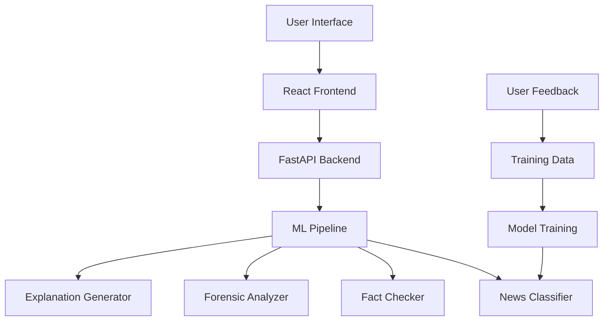

# 📰 News Contrast AI

> **Advanced AI-powered fake news detection with multi-layer analysis and real-time verification**

[](https://fastapi.tiangolo.com/)
[](https://reactjs.org/)
[](https://python.org/)
[](https://huggingface.co/transformers/)
[](https://tailwindcss.com/)

## 🚀 Overview

News Contrast AI is a comprehensive fake news detection system that combines multiple AI techniques to analyze and verify news content. The platform provides instant credibility scores, detailed explanations, and forensic analysis to help users identify misinformation and make informed decisions about news consumption.

### ✨ Key Features

- **🤖 Multi-Layer AI Analysis**: Advanced machine learning models for accurate fake news detection
- **⚡ Real-Time Detection**: Instant analysis of headlines and full articles
- **🔍 Fact Checking**: Cross-reference with trusted news sources
- **🔬 Forensic Analysis**: Deep linguistic and credibility assessment
- **📊 Detailed Explanations**: Clear reasoning behind each analysis
- **💬 User Feedback**: Continuous learning from user interactions
- **🔄 Model Retraining**: Dynamic improvement with new data
- **📱 Responsive UI**: Modern, accessible web interface

## 🏗️ Architecture



### 🔧 Technology Stack

**Frontend:**
- React 19 with modern hooks
- TailwindCSS for styling
- Vite for fast development
- React Router for navigation
- Lucide React for icons

**Backend:**
- FastAPI for high-performance API
- PyTorch for ML models
- Transformers (Hugging Face)
- Sentence Transformers for embeddings
- FAISS for vector similarity
- Beautiful Soup for web scraping
- SQLite for data storage

**AI/ML Components:**
- Custom fake news classification models
- Semantic similarity matching
- Named Entity Recognition (spaCy)
- Credibility scoring algorithms
- Explanation generation system

## 📋 Prerequisites

- Python 3.8 or higher
- Node.js 16 or higher
- 8GB+ RAM recommended
- CUDA-compatible GPU (optional, for faster training)

## 🛠️ Installation

### 1. Clone the Repository

```bash
git clone https://github.com/yourusername/news-contrast-ai.git
cd news-contrast-ai
```

### 2. Backend Setup

```bash
cd backend

# Create virtual environment
python -m venv venv

# Activate virtual environment
# Windows:
venv\Scripts\activate
# macOS/Linux:
source venv/bin/activate

# Install dependencies
pip install -r requirements.txt

# Download spaCy model
python -m spacy download en_core_web_sm
```

### 3. Frontend Setup

```bash
cd frontend

# Install dependencies
npm install

# or using yarn
yarn install
```

### 4. Data Setup (Optional)

```bash
# Create data directory
mkdir -p data

# Add your training datasets to data/ directory
# Supported formats: JSONL, CSV
```

## 🚀 Quick Start

### 1. Start the Backend Server

```bash
cd backend
python enhanced_main.py

# Or using uvicorn directly
uvicorn enhanced_main:app --reload --host 0.0.0.0 --port 8000
```

The API will be available at `http://localhost:8000`
- API Documentation: `http://localhost:8000/docs`
- Interactive API: `http://localhost:8000/redoc`

### 2. Start the Frontend Development Server

```bash
cd frontend
npm run dev
```

The web application will be available at `http://localhost:5173`

### 3. Access the Application

Open your browser and navigate to `http://localhost:5173` to start using News Contrast AI!

## 📖 Usage

### Web Interface

1. **Analyze Text**: Paste any news headline or article text
2. **Analyze URL**: Enter a news article URL for automatic content extraction
3. **Review Results**: Get detailed analysis including:
   - Overall credibility assessment
   - ML-based fake news classification
   - Fact-checking results
   - Forensic analysis
   - Detailed explanations
4. **Provide Feedback**: Help improve the system with your feedback

### API Usage

#### Analyze Text Content

```python
import requests

# Analyze text
response = requests.post("http://localhost:8000/analyze", json={
    "text": "Your news text here",
    "include_explanations": True
})

result = response.json()
print(result)
```

#### Analyze URL

```python
# Analyze URL
response = requests.post("http://localhost:8000/analyze", json={
    "url": "https://example-news-site.com/article",
    "include_explanations": True
})
```

#### Submit Feedback

```python
# Submit feedback
requests.post("http://localhost:8000/feedback", json={
    "text": "News text that was analyzed",
    "analysis_id": "unique_analysis_id", 
    "user_feedback": "correct",  # or "incorrect", "partially_correct"
    "comments": "Optional comments"
})
```

## 🔧 Configuration

### Environment Variables

Create a `.env` file in the backend directory:

```env
# API Configuration
API_HOST=0.0.0.0
API_PORT=8000

# Model Configuration
MODEL_NAME=distilbert-base-uncased
MAX_LENGTH=512
BATCH_SIZE=32

# Cache Configuration
CACHE_DIR=./cache
CACHE_EXPIRY_HOURS=24

# Logging
LOG_LEVEL=INFO
```

### Frontend Configuration

Update `frontend/src/services/api.js` for production:

```javascript
const API_BASE_URL = process.env.REACT_APP_API_URL || 'http://localhost:8000';
```

## 🧪 Development

### Running Tests

```bash
# Backend tests
cd backend
pytest tests/ -v

# Frontend tests
cd frontend
npm test
```

### Code Quality

```bash
# Backend linting
cd backend
black . --check
flake8 .

# Frontend linting
cd frontend
npm run lint
```

### Adding New Datasets

1. Place dataset files in the `data/` directory
2. Supported formats:
   - **JSONL**: `{"text": "news text", "label": "REAL"/"FAKE"}`
   - **CSV**: columns `text`, `label`
   - **Custom**: Implement in `data_processor.py`

3. Retrain the model:
```bash
curl -X POST http://localhost:8000/retrain
```

## 📊 Model Performance

The system achieves high accuracy across multiple evaluation metrics:

- **Accuracy**: >90% on test datasets
- **Precision**: >89% for fake news detection
- **Recall**: >91% for real news detection
- **F1-Score**: >90% overall performance

### Supported Datasets

- FakeNewsNet
- LIAR dataset
- Custom JSONL datasets
- User feedback data
- PHEME dataset (social media)

## 🔒 Security & Privacy

- No personal data collection
- Local data processing
- Secure API endpoints
- CORS protection
- Input validation and sanitization
- Rate limiting (configurable)

## 📈 Monitoring & Analytics

### System Status

Access system health and statistics at:
- `/` - Health check
- `/model/status` - Model information
- `/datasets/info` - Dataset statistics
- `/training-data/stats` - Live analysis data

### Performance Monitoring

The system tracks:
- Analysis response times
- Model accuracy metrics
- User feedback patterns
- System resource usage

## 🚀 Deployment

### Docker Deployment

```bash
# Build and run with Docker Compose
docker-compose up -d
```

### Manual Deployment

1. **Backend**: Deploy FastAPI app using uvicorn + nginx
2. **Frontend**: Build and serve static files
3. **Database**: Set up persistent storage for training data

```bash
# Build frontend
cd frontend
npm run build

# Serve backend
cd backend
uvicorn enhanced_main:app --host 0.0.0.0 --port 8000
```

### Cloud Deployment

Compatible with:
- **Vercel** (Frontend)
- **Railway/Heroku** (Backend)
- **AWS/GCP/Azure** (Full stack)
- **Docker containers**

## 🤝 Contributing

We welcome contributions! Please read our [Contributing Guidelines](CONTRIBUTING.md).

### Development Workflow

1. Fork the repository
2. Create a feature branch
3. Make your changes
4. Add tests for new functionality
5. Ensure all tests pass
6. Submit a pull request

### Areas for Contribution

- 🧠 New ML models and algorithms
- 🌐 Additional language support
- 📊 Enhanced analytics and visualizations
- 🔧 Performance optimizations
- 📝 Documentation improvements
- 🧪 Test coverage expansion

## 📋 Roadmap

### Version 2.0
- [ ] Multi-language support
- [ ] Social media integration
- [ ] Advanced image analysis
- [ ] Real-time news monitoring
- [ ] Browser extension

## 🐛 Troubleshooting

### Common Issues

**1. Model Loading Errors**
```bash
# Download required models
python -m transformers-cli download distilbert-base-uncased
```

**2. Memory Issues**
```python
# Reduce batch size in config
BATCH_SIZE = 16  # or lower
```

**3. CORS Issues**
- Ensure frontend URL is in CORS allowed origins
- Check API endpoint configuration

**4. Slow Performance**
- Enable GPU acceleration if available
- Adjust model caching settings
- Optimize dataset size
\
---

<div align="center">

**Built with ❤️ for a more informed world**

</div>